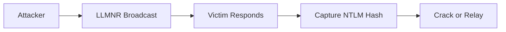

# Wizard — Security Research Blog

A custom Jekyll blog for cybersecurity research, CTF writeups, and detection engineering.

Built from scratch — no theme frameworks, no Bootstrap, no React. Pure Jekyll + SCSS + Vanilla JS.

## Stack

- **Jekyll 4.3** — static site generator
- **GitHub Pages** + **GitHub Actions** — hosting and CI/CD
- **SCSS** — custom design system with purple palette
- **Vanilla JS** — search, TOC, copy buttons, mobile nav
- **Giscus** — GitHub Discussions-based comments (optional)
- **Mermaid.js** — diagrams (opt-in per post)

## Local Development

### Prerequisites

- Ruby 3.x
- Bundler

```bash
gem install bundler
```

### Setup

```bash
git clone https://github.com/username/username.github.io
cd username.github.io
bundle install
```

### Run

```bash
bundle exec jekyll serve --livereload
```

Visit `http://localhost:4000`.

## Writing a Post

Create a file in `_posts/` following the naming convention `YYYY-MM-DD-title.md`:

```markdown
---
title: "Your Post Title"
date: 2026-05-07
categories: [Active Directory, Detection]
tags: [LLMNR, Responder, Sigma]
author: Wizard
toc: true
comments: true
description: "Brief description for SEO and social cards."
---

Your content here...
```

### Front Matter Options

| Field | Type | Description |
|---|---|---|
| `title` | string | Post title |
| `date` | date | Publication date |
| `categories` | list | 1-2 categories |
| `tags` | list | Relevant tags |
| `toc` | bool | Show sidebar TOC (default: true) |
| `comments` | bool | Enable Giscus comments |
| `description` | string | SEO meta description |
| `difficulty` | string | `Easy`, `Medium`, `Hard`, `Insane` (for writeups) |
| `mermaid` | bool | Load Mermaid.js for diagrams |

### Callout Boxes

```markdown
<div class="callout callout-note">
<strong>Note</strong>
Your note here.
</div>

<div class="callout callout-warning">
<strong>Warning</strong>
A warning message.
</div>

<div class="callout callout-detection">
<strong>Detection</strong>
Detection guidance.
</div>

<div class="callout callout-mitigation">
<strong>Mitigation</strong>
Defensive action.
</div>

<div class="callout callout-ioc">
<strong>IOC</strong>
Indicators of compromise.
</div>
```

### Mermaid Diagrams

Set `mermaid: true` in front matter, then:

````markdown

````

## Collections

### Talks (`_talks/`)

```markdown
---
title: "Talk Title"
date: 2026-01-15
event: "Conference Name"
location: "City, Country"
slides_url: "https://..."
video_url: "https://..."
---

Talk description.
```

### Labs (`_labs/`)

```markdown
---
title: "Lab Name"
description: "Brief description"
tags: [Active Directory, Windows]
status: Active
---

Lab documentation.
```

## Configuration

Edit `_config.yml`:

```yaml
title: YourName
url: "https://username.github.io"
author:
  name: YourName
  github: "yourusername"
```

### Enable Giscus Comments

1. Go to [giscus.app](https://giscus.app) to get your `repo_id` and `category_id`
2. Update `_config.yml`:

```yaml
giscus:
  enabled: true
  repo: "username/username.github.io"
  repo_id: "R_xxxxxxxx"
  category: "General"
  category_id: "DIC_xxxxxxxx"
```

### Custom Domain

1. Add a `CNAME` file at the repo root:
   ```
   blog.yourdomain.com
   ```
2. Configure DNS at your provider:
   ```
   CNAME blog -> username.github.io
   ```

## Deployment

Push to `main` — GitHub Actions builds and deploys automatically.

```bash
git add .
git commit -m "Add new post"
git push origin main
```

## Project Structure

```
.
├── _config.yml          # Jekyll configuration
├── Gemfile              # Ruby dependencies
├── index.md             # Homepage
├── about.md             # About page
├── research.md          # Research index
├── writeups.md          # CTF writeups index
├── talks.md             # Talks index
├── labs.md              # Labs index
├── contact.md           # Contact page
├── search.json          # Search index template
├── 404.html             # Custom 404
├── _layouts/            # Page templates
├── _includes/           # Reusable components
├── _sass/               # SCSS source
├── _posts/              # Blog posts
├── _talks/              # Talk entries
├── _labs/               # Lab entries
├── _data/               # Navigation, social links
├── assets/
│   ├── css/             # Compiled CSS entry point
│   ├── js/              # JavaScript
│   └── images/          # SVG assets
└── .github/workflows/   # CI/CD pipeline
```

## Security Headers

For Cloudflare or Netlify deployments, add these headers:

```
Content-Security-Policy: default-src 'self'; script-src 'self' https://giscus.app; frame-src https://giscus.app
X-Frame-Options: SAMEORIGIN
X-Content-Type-Options: nosniff
Referrer-Policy: strict-origin-when-cross-origin
Permissions-Policy: camera=(), microphone=(), geolocation=()
```

## License

Content: All Rights Reserved  
Code/theme: MIT
